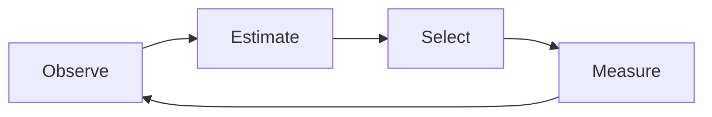
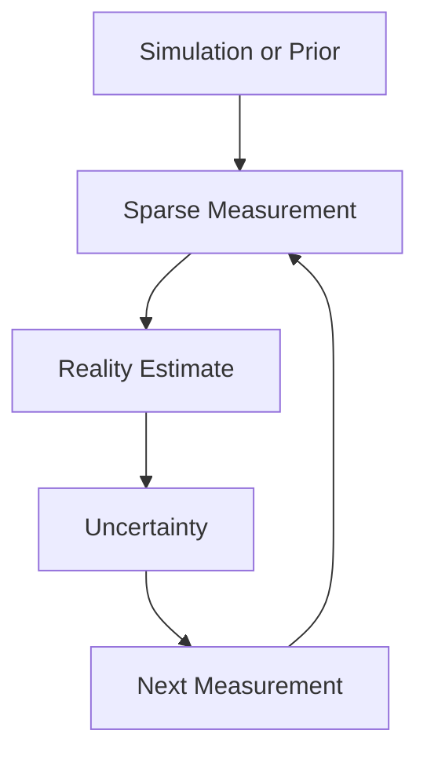
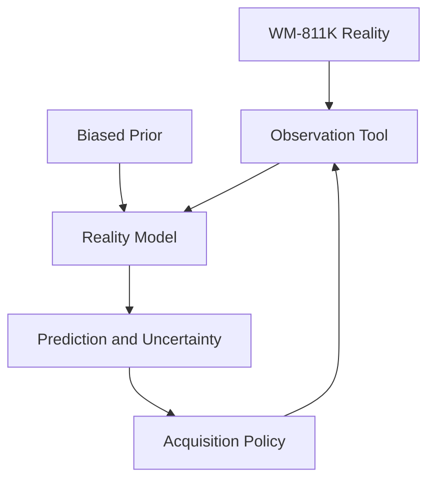

# NANO GitHub Pages 구현 가이드

> 이 문서는 AI 코딩 에이전트가 NANO 프로젝트 소개 사이트를 VitePress로 구현하고 GitHub Pages에 배포하기 위한 작업 명세다.

## 1. 프로젝트 정의

### 프로젝트명

**NANO — Reality-Aware AI Development Lifecycle for Semiconductor Manufacturing**

### 한 문장 설명

> NANO is an autonomous metrology agent that identifies what it does not know and selects the next most valuable measurement to close the Sim2Real gap.

### 해결하려는 문제

반도체 제조 현장의 AI는 현실 전체가 아니라 측정된 일부만 학습한다.

- 수백만 개의 die를 전수 검사할 수 없다.
- 공정·계측 데이터에는 결측값이 많다.
- SEM/TEM 이미지는 매우 좁은 국소 영역만 대표한다.
- 시뮬레이션과 실제 제조 결과 사이에는 Sim2Real gap이 존재한다.
- 높은 모델 정확도만으로 데이터가 현실을 대표한다고 보장할 수 없다.

NANO는 주어진 측정 예산 안에서 전체 wafer를 추정하고, 불확실성을 계산하며, 다음으로 측정할 die를 능동적으로 선택한다.

### 핵심 메시지

**Maximize knowledge of reality per measurement.**

사이트의 모든 페이지와 시각화는 이 메시지를 강화해야 한다.

---

## 2. 작업 목표

VitePress 기반의 정적 문서 사이트를 구현한다. 단순한 README 복제본이 아니라, AI 심사자와 기술 방문자가 다음 내용을 빠르게 확인할 수 있는 프로젝트 랜딩 페이지 겸 기술 문서여야 한다.

1. 어떤 산업 문제를 해결하는가?
2. 왜 기존 AI DLC로는 충분하지 않은가?
3. 어떤 데이터를 사용했는가?
4. NANO Agent는 어떻게 관측하고 결정하는가?
5. Random/Grid 대비 실제로 나아졌는가?
6. 저장소를 어떻게 실행하고 결과를 재현하는가?

### 완료 조건

- `npm install && npm run docs:dev`로 로컬 실행된다.
- `npm run docs:build`가 경고나 오류 없이 성공한다.
- GitHub Actions가 `main` 브랜치 push 시 GitHub Pages를 배포한다.
- 저장소가 사용자/조직 Pages와 프로젝트 Pages 양쪽에 대응할 수 있다.
- 모바일과 데스크톱에서 레이아웃이 깨지지 않는다.
- JavaScript가 비활성화되어도 핵심 설명과 정적 결과 이미지는 읽을 수 있다.
- 모든 주장과 수치는 저장소 내 실험 결과 또는 출처로 추적 가능하다.
- 비공개 회사 정보, 내부 데이터, 사내 용어, 실제 제품명은 포함하지 않는다.

---

## 3. 기술 스택과 제약

### 필수

- VitePress 최신 안정 버전
- TypeScript 설정 파일
- Markdown 중심의 콘텐츠
- GitHub Actions 기반 GitHub Pages 배포
- Mermaid 다이어그램 지원
- 로컬 또는 저장소에 포함된 정적 이미지 사용
- 접근 가능한 semantic HTML과 키보드 탐색

### 권장

- Node.js 20 이상
- 패키지 매니저는 저장소에 이미 lockfile이 있으면 그것을 따른다.
- lockfile이 없다면 `npm`을 사용하고 `package-lock.json`을 커밋한다.
- 아이콘이 필요하면 인라인 SVG 또는 가벼운 아이콘 패키지를 사용한다.

### 금지

- 무거운 SPA 프레임워크를 별도로 얹지 않는다.
- 서버, 데이터베이스, API 키 또는 런타임 백엔드에 의존하지 않는다.
- 방문자 추적 스크립트를 기본으로 추가하지 않는다.
- 실험으로 생성되지 않은 benchmark 숫자를 예시처럼 노출하지 않는다.
- 회사 내부 데이터로 오인될 수 있는 이미지나 수치를 사용하지 않는다.
- 장식 목적의 과도한 animation, parallax, particle effect를 넣지 않는다.

---

## 4. 저장소 사전 조사

코드를 변경하기 전에 다음을 수행한다.

1. 저장소의 `README.md`, `package.json`, Python 진입점, 실험 스크립트, `results/`, `data/`, 라이선스를 확인한다.
2. 기존 문서 디렉터리나 VitePress 설정이 있으면 새로 중복 생성하지 말고 확장한다.
3. 실제 생성된 그래프, GIF, metric 파일을 식별한다.
4. 실행 명령은 추측하지 말고 저장소 코드와 실제 실행 결과에서 확인한다.
5. 저장소 이름과 GitHub Pages base path를 확인한다.
6. 기존 사용자 변경사항은 보존하고 사이트 작업과 무관한 파일은 수정하지 않는다.

실험 결과가 아직 없다면 사이트 구조와 placeholder 설명까지만 구현한다. 숫자 영역에는 거짓 예시값 대신 `Run benchmark to generate results` 상태를 표시한다.

---

## 5. 정보 구조

다음 구조를 기본으로 사용한다.

```text
docs/
├── index.md
├── problem.md
├── approach.md
├── data.md
├── benchmark.md
├── demo.md
├── architecture.md
├── reproducibility.md
├── limitations.md
├── public/
│   ├── logo.svg
│   ├── favicon.svg
│   ├── social-card.png
│   └── results/
└── .vitepress/
    ├── config.mts
    └── theme/
        ├── index.ts
        ├── custom.css
        └── components/
            ├── AgentLoop.vue
            ├── MetricCard.vue
            ├── WaferComparison.vue
            └── BenchmarkChart.vue
```

저장소 규모가 작다면 페이지 수를 억지로 늘리지 않는다. `problem`, `approach`, `data`, `benchmark`, `reproducibility`는 유지하고 나머지는 관련 페이지에 합칠 수 있다.

### 내비게이션

상단 메뉴:

- Overview
- Approach
- Data
- Results
- Demo
- Reproduce
- GitHub

사이드바는 기술 문서 페이지에서만 표시하고 홈에서는 숨긴다.

---

## 6. 홈 화면 명세

홈은 방문 후 20초 안에 문제, 방법, 증거를 이해하게 해야 한다.

### Hero

- Eyebrow: `Team NANO · AI Development Lifecycle Hackathon`
- Title: `NANO`
- Subtitle: `Reality-Aware AI Development Lifecycle for Semiconductor Manufacturing`
- 핵심 문장: `An autonomous metrology agent that knows what it does not know.`
- 보조 문장: simulation prior와 sparse measurement로 reality를 추정하고, uncertainty를 계산하며, 가장 가치 있는 다음 측정을 선택한다고 설명한다.
- Primary CTA: `See how it works` → `/approach`
- Secondary CTA: `View results` → `/benchmark`
- GitHub CTA: 실제 저장소 URL

### Hero 시각화

가능하면 실제 결과 자산을 사용해 다음 4개 상태를 한 화면에서 비교한다.

1. Biased Simulation Prior
2. Sparse Measurements
3. Predicted Reality + Uncertainty
4. Recommended Next Die

실제 이미지가 없을 때는 CSS나 단순 SVG로 개념도를 만든다. 임의의 실제 benchmark처럼 보이게 하지 말고 `Conceptual illustration`이라고 표시한다.

### Problem strip

다음 네 문제를 짧은 카드로 보여준다.

- Sparse inspection
- Sim2Real mismatch
- Local measurement bias
- Missing process data

### Agent loop

다음 순환을 compact diagram으로 표시한다.



각 단계의 의미:

- Observe: sparse real measurements를 읽는다.
- Estimate: reality, uncertainty, Sim2Real gap을 계산한다.
- Select: NANO Acquisition Score가 가장 높은 위치를 고른다.
- Measure: 숨겨진 real value를 관측하고 모델을 갱신한다.

### Evidence section

실험 결과가 있으면 홈에 다음을 노출한다.

- 동일한 measurement budget에서 NANO, Random, Grid의 reconstruction error
- 초기 simulation error 대비 최종 corrected error
- 사용한 wafer 수와 seed 수
- metric 이름 및 낮을수록/높을수록 좋은지

실험 결과는 결과 파일에서 생성하거나 단일 데이터 소스에서 읽도록 한다. Markdown과 차트에 같은 숫자를 이중 하드코딩하지 않는다.

### Closing CTA

`Run the experiment yourself` 버튼을 `/reproducibility`로 연결한다.

---

## 7. 페이지별 콘텐츠 명세

### `problem.md` — Why Reality Awareness?

- `available data ≠ represented reality`를 핵심 명제로 제시한다.
- 전수 검사 불가능, spatial sampling bias, SEM/TEM field-of-view, feature missingness, Sim2Real gap을 설명한다.
- 기존 `Data → Train → Evaluate → Deploy` 흐름의 한계를 보여준다.
- NANO가 제안하는 lifecycle을 다음처럼 제시한다.



### `approach.md` — Agentic Active Metrology

- 입력: die 좌표, simulation prediction, optional measured value
- 출력: prediction map, uncertainty map, reality-gap map, next measurement
- acquisition function을 실제 코드에 맞춰 설명한다.
- 예시 형태:

```text
acquisition = uncertainty × simulation disagreement × spatial novelty
```

실제 구현이 단순 `argmax(uncertainty)`라면 위 식을 구현된 것처럼 쓰지 않는다. 문서와 코드를 일치시킨다.

- 측정 예산 종료 조건과 deterministic seed 처리 방식을 설명한다.

### `data.md` — Dataset and Experimental Design

MVP 데이터는 **WM-811K wafer map dataset**을 사용한다.

반드시 다음을 명시한다.

- 원본 데이터의 출처와 라이선스/사용 조건 링크
- 저장소에 포함된 subset의 생성 방식과 크기
- wafer map 값의 의미와 전처리 규칙
- train/test 또는 evaluation wafer 선택 방식
- random seed
- 실제 wafer map을 hidden ground truth인 `Reality`로 취급한 이유
- reality를 변형해 biased simulation prior를 생성한 방법
- sparse observation mask 생성 방식

핵심 실험 설계를 다음 문장으로 명확히 적는다.

> We treat the complete WM-811K wafer map as hidden reality and expose only sparse observations to the agent. A deliberately biased prior emulates simulation mismatch, allowing the Sim2Real correction process to be evaluated against known ground truth.

이 synthetic Sim2Real 설정이 실제 TCAD/공정 simulation 자체가 아니라 개념 검증용 proxy라는 한계를 분명히 밝힌다.

### `benchmark.md` — Evidence

동일한 초기 관측값, 동일한 wafer, 동일한 추가 측정 예산으로 다음을 비교한다.

| Strategy | Selection rule |
| --- | --- |
| Random | unmeasured die 중 무작위 선택 |
| Grid | 공간적으로 균일한 위치 선택 |
| NANO | 구현된 acquisition score 최대 위치 선택 |

필수 차트:

1. Measurements vs reconstruction error
2. Simulation prior와 최종 reconstruction 비교
3. Uncertainty map before/after
4. 가능하면 wafer별 paired improvement distribution

필수 표:

- metric mean
- standard deviation 또는 confidence interval
- wafer 수
- seed 수
- initial/final measurement count
- NANO의 baseline 대비 상대 개선율

상대 개선율 정의를 명시한다.

```text
relative improvement = (baseline error - NANO error) / baseline error × 100
```

결과가 NANO에 불리해도 숨기지 않는다. 실패 사례와 패턴별 편차를 `Where NANO fails`에 기록한다.

### `demo.md` — Interactive Story

정적 GitHub Pages이므로 Python/Streamlit을 직접 실행하지 않는다.

다음 중 저장소 상황에 맞는 방식을 사용한다.

1. 가장 권장: 실험에서 생성된 GIF/MP4와 단계별 설명
2. 선택: 미리 생성된 JSON을 읽는 가벼운 Vue component
3. fallback: step 0, 5, 10, 20의 정적 이미지 carousel

방문자가 확인해야 할 흐름:

- simulation prior 확인
- 초기 sparse measurement 확인
- NANO가 next die를 선택한 이유 확인
- 측정 추가 후 uncertainty 감소 확인
- 예산 종료 후 ground truth와 비교

### `architecture.md` — System Design

실제 Python 모듈명에 맞춰 architecture를 작성한다. 이상적인 구조를 구현된 구조처럼 그리지 않는다.



각 모듈의 입력, 출력, 책임을 표로 정리하고 관련 소스 파일에 GitHub 링크를 건다.

### `reproducibility.md` — Run It

복사 가능한 명령을 최소 단계로 제공한다.

- Python 버전
- 가상환경 생성
- dependency 설치
- demo 실행
- benchmark 실행
- test 실행
- 결과 artifact 위치
- seed 변경법

명령은 CI 또는 깨끗한 환경에서 실제 검증한 것만 적는다.

### `limitations.md` — Honest Scope

- synthetic biased prior는 실제 physics simulator가 아니다.
- WM-811K label은 실제 연속형 metrology 값과 다르다.
- uncertainty calibration이 완전하다고 주장하지 않는다.
- measurement cost가 위치마다 동일하다고 가정했는지 밝힌다.
- spatial accessibility와 tool scheduling은 MVP 범위 밖이다.

확장 방향:

- SECOM: feature missingness
- SEM/TEM: field-of-view selection
- TCAD/CAE/RCWA: real simulator integration
- wafer/lot/tool hierarchy와 provenance
- heterogeneous measurement cost를 반영한 acquisition

---

## 8. 디자인 시스템

### 분위기

정밀하고 기술적이며 차분한 반도체 계측 대시보드 느낌으로 만든다. 일반적인 보라색 AI 랜딩 페이지나 과도한 cyberpunk 스타일은 피한다.

### 색상

- Background: deep navy/near black
- Surface: dark blue-gray
- Primary: clean cyan
- Secondary: restrained violet
- Success/observed: green
- Warning/uncertainty: amber
- Error/reality gap: coral/red

색만으로 상태를 구분하지 말고 label, symbol, pattern을 함께 사용한다.

### 타이포그래피

- 본문은 시스템 sans-serif 또는 저장소에 포함 가능한 오픈 폰트
- 코드와 metric은 monospace
- 외부 폰트를 런타임에 불러오지 않아도 정상 표시되어야 한다.

### Wafer 시각화 규칙

- wafer는 원형 boundary와 die grid가 명확해야 한다.
- observed, unobserved, recommended point에 legend를 둔다.
- prediction과 uncertainty는 같은 color scale을 쓰지 않는다.
- 모든 차트에 title, axis 또는 scale, unit/metric, caption을 둔다.
- ground truth는 `Evaluation only` 또는 `Hidden from agent`로 표시한다.

### 반응형

- 데스크톱에서 비교 패널은 최대 4열까지 허용한다.
- 태블릿에서는 2열, 모바일에서는 1열로 쌓는다.
- 표는 가로 스크롤을 허용하되 첫 열의 의미가 유지되어야 한다.
- CTA와 내비게이션은 키보드 focus 상태가 보이게 한다.

---

## 9. VitePress 설정

### npm scripts

기존 `package.json`이 없다면 다음 명령을 제공한다.

```json
{
  "scripts": {
    "docs:dev": "vitepress docs",
    "docs:build": "vitepress build docs",
    "docs:preview": "vitepress preview docs"
  }
}
```

### base path

GitHub 프로젝트 Pages는 보통 `https://<owner>.github.io/<repo>/`이므로 VitePress `base`가 `/<repo>/`여야 한다. 사용자/조직 Pages 저장소(`<owner>.github.io`)이면 `/`를 사용한다.

저장소 이름을 코드에 여러 번 하드코딩하지 않는다. 가능한 경우 환경변수를 지원한다.

```ts
const repo = process.env.GITHUB_REPOSITORY?.split('/')[1]
const isUserPages = repo?.endsWith('.github.io')

export default defineConfig({
  base: process.env.DOCS_BASE ?? (isUserPages ? '/' : repo ? `/${repo}/` : '/'),
})
```

로컬 개발에서 asset path가 깨지지 않도록 `/results/foo.png`처럼 base를 무시하는 절대 URL을 피한다. Markdown public asset은 `withBase()`가 필요한지 확인하거나 VitePress가 지원하는 상대 경로/asset import를 사용한다.

### SEO와 공유

- 명확한 title과 description
- canonical URL은 실제 Pages 주소가 확정된 경우에만 설정
- Open Graph/Twitter metadata
- `social-card.png` 1200×630
- favicon
- 각 페이지의 의미 있는 heading hierarchy
- 실제 공개 URL이 없으면 placeholder domain을 넣지 않는다.

---

## 10. GitHub Pages workflow

`.github/workflows/deploy-docs.yml`을 생성한다.

요구사항:

- trigger: `main` push 및 수동 실행
- 최소 권한: `contents: read`, `pages: write`, `id-token: write`
- concurrency를 사용해 중복 배포를 제어한다.
- Node.js 20 이상
- lockfile 기반 clean install (`npm ci`)
- VitePress build
- `docs/.vitepress/dist` 업로드
- 공식 Pages actions 사용

GitHub Actions의 third-party action은 major tag보다 가능한 경우 검증된 공식 action의 안정 버전을 사용한다. workflow 작성 시 현재 GitHub Pages 공식 문서의 권장 버전을 확인한다.

README에는 저장소 설정에서 Pages source를 **GitHub Actions**로 선택해야 한다고 안내한다.

---

## 11. 실험 자산 연동

Python benchmark가 생성하는 결과와 사이트 자산을 연결한다.

권장 패턴:

```text
results/
├── benchmark_summary.json
├── error_curve.svg
├── wafer_comparison.webp
├── uncertainty_before_after.webp
└── demo.gif
```

- 원본 결과의 canonical 위치는 기존 프로젝트 구조를 따른다.
- docs용 파일 복사가 필요하면 `scripts/sync-doc-assets.*`를 만들고 수동 복사를 반복하지 않는다.
- benchmark JSON schema를 간단히 문서화한다.
- 차트 생성 스크립트, 입력 metric, seed가 추적 가능해야 한다.
- 빌드 시 결과가 없어도 명확한 안내와 함께 사이트가 빌드되게 한다.
- 대형 GIF는 WebP/MP4 또는 최적화된 frame 수를 고려한다.

### 차트 데이터 무결성

- 차트와 표는 가능하면 동일 JSON에서 생성한다.
- metric 방향을 명시한다. 예: `MAE ↓`.
- mean만 보여주지 말고 분산 또는 표본 수를 함께 표시한다.
- 축을 잘라 과장하지 않는다.
- NANO와 baseline은 동일한 budget/initial observations를 사용한다.

---

## 12. 콘텐츠 작성 원칙

- 기본 사이트 언어는 영어로 한다. 국제적인 GitHub 심사 환경과 기술 공유에 유리하다.
- 문장은 짧고 직접적으로 쓴다.
- `AI-powered`, `revolutionary`, `game-changing` 같은 빈 표현은 피한다.
- `accuracy`와 `reality confidence`를 구분한다.
- NANO가 직접 증명한 범위와 미래 확장 아이디어를 명확히 분리한다.
- `simulation`, `prior`, `measurement`, `ground truth`, `uncertainty` 용어를 페이지 전체에서 일관되게 사용한다.
- 첫 등장 시 `AI Development Lifecycle (AI DLC)`를 풀어 쓴다.
- 제품 주장마다 관련 결과, 코드 또는 제한사항으로 연결한다.

### 권장 핵심 카피

```text
Semiconductor AI learns from what we measure—not necessarily from reality.
```

```text
NANO turns the AI Development Lifecycle from training on available data into actively acquiring the data needed to understand reality.
```

```text
It does not only predict. It quantifies uncertainty and decides what should be measured next.
```

---

## 13. 구현 순서

1. 저장소와 실제 실행 경로를 조사한다.
2. VitePress 최소 구성과 base path를 구현한다.
3. 홈과 핵심 문서 페이지를 작성한다.
4. 기존 실험 결과를 문서 자산으로 연결한다.
5. 필요한 최소 Vue component만 구현한다.
6. Mermaid, 코드 블록, 표, 이미지 caption을 정리한다.
7. GitHub Pages workflow를 추가한다.
8. 로컬 build와 preview를 검증한다.
9. 링크, 모바일, 접근성, asset 경로를 검사한다.
10. README에 Docs 링크와 로컬 실행 방법을 추가한다.

각 단계가 끝날 때 build 가능한 상태를 유지한다.

---

## 14. 검증 체크리스트

### 기능

- [ ] 모든 상단 메뉴와 sidebar 링크가 유효하다.
- [ ] GitHub 저장소 링크가 올바르다.
- [ ] 새로고침과 deep link 접속이 정상이다.
- [ ] 프로젝트 Pages base path에서 이미지와 CSS가 정상 로드된다.
- [ ] dark/light mode 양쪽에서 텍스트와 차트가 읽힌다.
- [ ] Mermaid가 build 후 정상 표시된다.
- [ ] demo 자산이 없는 상태에서도 build가 실패하지 않는다.

### 콘텐츠

- [ ] 문제, 솔루션, 데이터, agent loop, benchmark가 홈에서 파악된다.
- [ ] WM-811K 출처와 subset 생성법이 명시되어 있다.
- [ ] synthetic Sim2Real proxy임을 숨기지 않는다.
- [ ] 모든 benchmark 숫자가 실제 artifact와 일치한다.
- [ ] baseline 비교 조건이 공정하다.
- [ ] limitation과 future work가 분리되어 있다.
- [ ] 내부/기밀 정보가 없다.

### 품질

- [ ] `npm ci` 성공
- [ ] `npm run docs:build` 성공
- [ ] 깨진 내부 링크 없음
- [ ] 브라우저 console error 없음
- [ ] 이미지에 대체 텍스트가 있음
- [ ] heading 순서가 논리적임
- [ ] 모바일 폭 375px에서 가로 overflow가 없음
- [ ] 주요 텍스트/배경 contrast가 WCAG AA 수준임

---

## 15. 에이전트 최종 보고 형식

작업 완료 후 다음만 간결하게 보고한다.

1. 구현한 페이지와 핵심 component
2. 실제 결과 자산을 어떻게 연결했는지
3. 실행한 검증 명령과 결과
4. GitHub Pages 배포를 위해 사용자가 해야 할 설정
5. 남아 있는 limitation 또는 실제 데이터/URL이 필요한 placeholder

변경한 파일 목록만 길게 나열하지 말고, 사이트가 전달하는 이야기와 검증 결과를 먼저 설명한다.

---

## 16. Definition of Done

아래 질문에 모두 `Yes`라고 답할 수 있을 때 완료다.

- 저장소를 처음 본 사람이 20초 안에 NANO의 문제와 차별점을 이해하는가?
- NANO가 단순 wafer interpolation이 아니라 measurement-decision agent임이 드러나는가?
- 사용 데이터와 synthetic Sim2Real 설계가 투명한가?
- NANO가 baseline보다 나은지 같은 조건에서 재현 가능하게 검증되는가?
- 결과가 좋지 않은 경우도 정직하게 표시되는가?
- clone, install, build, benchmark 경로가 실제로 동작하는가?
- GitHub Pages project base path에서도 모든 자산이 정상인가?
- 기밀 정보 없이 외부 공개 가능한가?

최종 산출물은 예쁜 소개 페이지가 아니라, **NANO의 문제 정의와 실험 증거를 저장소 자체가 설명하게 만드는 재현 가능한 기술 사이트**여야 한다.
