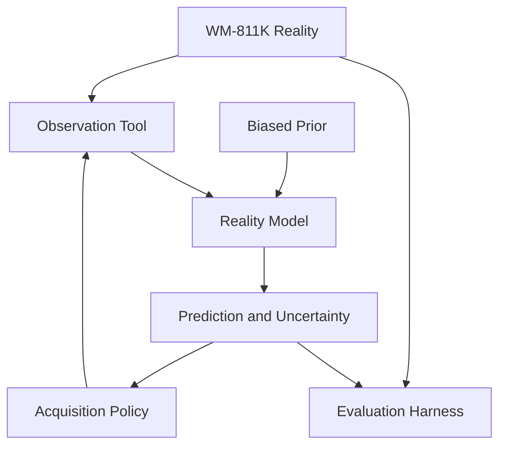

# System Design

::: danger This describes a target design, not shipped code
There is **no Python package in this repository yet**. The module names, paths and signatures below
are the intended structure. They are written down so the first implementation has a contract to meet
and so this page can be corrected against reality afterwards rather than the other way around.

When the code lands, every row in the table below must either point at a file that exists or be
deleted. A diagram of an ideal architecture presented as an implemented one is exactly the
misrepresentation this project argues against.
:::

## Data flow

Reality reaches the agent only through the observation tool. The biased prior and the observed values feed the reality model, which emits prediction and uncertainty; the acquisition policy reads those and asks the observation tool for one more die. Reality also flows directly to the evaluation harness, which the agent never reads.

The single most important property of this graph: **reality reaches the agent only through the
observation tool**. The direct edge from reality to the evaluation harness carries ground truth that
the agent never sees. Any shortcut across that boundary invalidates every number on the
[benchmark page](./benchmark).

## Modules

| Module | Responsibility | Input | Output |
| --- | --- | --- | --- |
| `nano.data` | Load WM-811K, filter and index the evaluation subset, expose the in-wafer die mask | Dataset path, seed | Wafer records: reality field, die mask, pattern label |
| `nano.prior` | Generate the deliberately biased simulation prior from a reality field | Reality field, bias parameters | Prior field defined on every in-wafer die |
| `nano.tools.observe` | The only channel to reality. Reveals one die's value and spends one unit of budget | Die index | Measured value, updated observation state |
| `nano.model` | Reconcile prior with observations; produce prediction, uncertainty and reality-gap maps | Prior, observed mask, observed values | `prediction`, `uncertainty`, `reality_gap` |
| `nano.policy` | Score unmeasured dies and select the next measurement | Model outputs, observed mask | `next_index`, `next_score`, per-term breakdown |
| `nano.agent` | Run the Observe → Estimate → Select → Measure loop until the budget is exhausted | Wafer record, budget, seed | Decision trace, per-step metrics |
| `nano.baselines` | Random and Grid selection rules behind the same policy interface | Model outputs, observed mask | `next_index` |
| `nano.evaluate` | Score predictions against hidden ground truth and aggregate over wafers and seeds | Predictions, reality fields | `results/benchmark_summary.json` |

## Boundaries that matter

**One tool, one budget.** Every measurement goes through `nano.tools.observe`. Budget accounting
lives inside the tool, not in the caller, so no strategy can quietly take an extra look.

**Baselines share the policy interface.** Random and Grid implement the same signature as the NANO
policy and are driven by the same loop. Swapping the selection rule is the only change between arms —
which is what makes the comparison mean anything.

**Evaluation is downstream of everything.** `nano.evaluate` is the only module that touches full
reality fields, and it never returns anything to the agent.

**One results file.** `nano.evaluate` writes `results/benchmark_summary.json`; the site reads it.
Charts, tables and headline numbers on this site all derive from that file, so a number cannot be
updated in one place and stale in another. Schema is documented on the
[benchmark page](./benchmark).

## Documentation site

The site is deliberately boring: a static VitePress build with no backend, no runtime data fetching
and no analytics.

| Piece | Path | Role |
| --- | --- | --- |
| Config | `docs/.vitepress/config.mts` | Nav, sidebar, SEO, Mermaid, base-path handling for project and user Pages |
| Results loader | `docs/.vitepress/data/benchmark.data.mts` | Reads and validates `results/benchmark_summary.json` at build time |
| Asset loader | `docs/.vitepress/data/assets.data.mts` | Lists `docs/public/results/` so missing figures degrade to a pending state |
| Components | `docs/.vitepress/theme/components/` | `AgentLoop`, `WaferComparison`, `BenchmarkChart`, `BenchmarkTable`, `EvidenceStrip`, `MetricCard`, `ResultAsset` |
| Asset sync | `scripts/sync-doc-assets.mjs` | Copies published figures from `results/` into `docs/public/results/` |
| Deployment | `.github/workflows/deploy-docs.yml` | Builds on push to `main` and publishes to GitHub Pages |

Components render at build time, so the pages carry their content as static HTML. With JavaScript
disabled the prose, the tables, the wafer schematic and the result figures all still read; only
Mermaid diagrams and the search box need the client runtime.

Next: [run it yourself →](./reproducibility)
