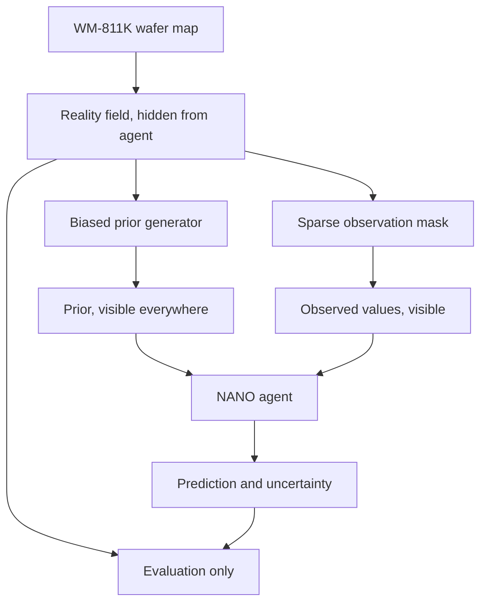

# Dataset and Experimental Design

## Source

The MVP uses the **WM-811K wafer map dataset** — 811,457 real wafer maps collected from
semiconductor manufacturing, released alongside Wu, Jang and Chen, *"Wafer Map Failure Pattern
Recognition and Similarity Ranking for Large-Scale Data Sets"*, IEEE Transactions on Semiconductor
Manufacturing, 2015.

| | |
| --- | --- |
| Canonical distribution | [MIR Lab public datasets](http://mirlab.org/dataSet/public/) (`LSWMD.pkl`) |
| Commonly used mirror | [Kaggle: WM-811K wafer map](https://www.kaggle.com/datasets/qingyi/wm811k-wafer-map) |
| Terms of use | Set by the distributor, not by this project. Check the licence on the page you download from before redistributing. |
| Included in this repository | **No raw WM-811K data is committed here.** The dataset is downloaded locally; only a derived subset index is versioned. |

::: warning Implementation status
The subset builder and the benchmark harness are **not in this repository yet**. This page specifies
the design they must implement. Any field written as `recorded at run time` is deliberately empty:
it will be filled from the artifacts the run produces, not typed in by hand.
:::

## Wafer map semantics

Each wafer map is a 2-D integer array on the die grid:

| Value | Meaning | Used as |
| --- | --- | --- |
| `0` | Outside the wafer / no die at this grid position | Masked out, never predicted, never measured |
| `1` | Die present, pass | Reality value `0.0` |
| `2` | Die present, fail | Reality value `1.0` |

So the quantity NANO reconstructs is a **binary per-die failure indicator on the in-wafer die grid**.
Reconstruction error is measured only over in-wafer positions.

## Preprocessing rules

1. Drop wafers whose die grid is smaller than the minimum usable size, because a sparse budget is
   meaningless on a handful of dies.
2. Keep only wafers with a labelled failure pattern, so results can be broken down by pattern type.
3. Build the in-wafer mask from `value != 0` and treat it as known geometry — the agent is allowed to
   know which grid positions hold a die.
4. Map `{1 → 0.0, 2 → 1.0}` to get the reality field.
5. Do not resize or interpolate wafers. Spatial structure is the signal being studied.

## The core experimental idea

> We treat the complete WM-811K wafer map as hidden reality and expose only sparse observations to
> the agent. A deliberately biased prior emulates simulation mismatch, allowing the Sim2Real
> correction process to be evaluated against known ground truth.

This is what makes the experiment scoreable. Real metrology never has the full wafer to compare
against; here it does, and it is withheld from the agent so the comparison stays fair.

A WM-811K wafer map becomes the hidden reality field. From it, a biased prior generator produces the prior the agent sees everywhere, and an observation mask produces the few values it may read. Both feed the agent, which outputs prediction and uncertainty. Reality and prediction meet only inside the evaluation harness.

### Building the biased prior

The prior must be *wrong in a structured way*, because that is how simulation is wrong. Random noise
added to ground truth would be a much easier problem and would not test anything interesting. The
prior is generated from the reality field by composing:

- **Radial bias** — systematically under-predict failure towards the wafer edge, the classic
  signature of a model calibrated on centre measurements.
- **Spatial smoothing** — blur out fine structure, so local patterns present in reality are absent
  from the prior.
- **Global offset and gain** — a calibration error applied to the whole wafer.

The bias parameters are fixed per run, recorded in the results file, and identical across all
strategy arms.

### Drawing the initial observation mask

The initial mask is drawn **centre-biased, not uniformly**, to reproduce the sampling bias described
on the [problem page](./problem). All strategies — Random, Grid and NANO — start from the *same*
initial mask for a given `(wafer, seed)` pair. Only the additional measurements differ.

## Evaluation protocol

| Setting | Value |
| --- | --- |
| Evaluation wafers | Sampled by seed from the filtered subset, stratified across failure patterns · `recorded at run time` |
| Seeds | `recorded at run time` |
| Initial measurements | `recorded at run time` |
| Additional measurement budget | `recorded at run time` |
| Metric | Reconstruction error over in-wafer dies, direction recorded in the results file |
| Ground-truth access | Evaluation harness only Hidden from agent |

There is no train/test split in the usual sense. Nothing is fitted across wafers: each wafer is an
independent active-measurement episode, and the reported metric is the distribution over
`wafers × seeds`. That is a deliberate choice — it isolates the selection rule from any benefit a
cross-wafer model might bring.

## Honesty about the proxy

This setup is a **proxy for Sim2Real, not Sim2Real itself**:

- The prior is a synthetic distortion of ground truth, not the output of a TCAD, CAE or RCWA
  simulator. It has no physics in it.
- WM-811K labels are binary pass/fail, not continuous metrology readings such as CD, thickness or
  overlay. Real metrology values are continuous and noisy, and the estimator would face a different
  problem.
- Every die is assumed equally expensive to measure, which is not true of real tool scheduling.

What the proxy *does* support is the question this project is actually asking: given a fixed budget
and a biased prior, does choosing measurements by acquisition score beat choosing them by convention?
Full detail in [Honest Scope](./limitations).

Next: [the results →](./benchmark)
