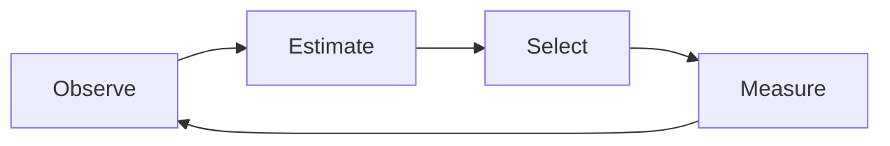

## Semiconductor AI learns from what we measure — not necessarily from reality

A model can score well on the data you have and still be wrong about the wafer. Full inspection of
millions of dies is impossible, so every dataset is a sample, and every sample carries a bias the
metric does not show. High accuracy is not the same thing as confidence about reality.

  

    
Constraint 01

    <h3>Sparse inspection</h3>
    
Only a small fraction of dies can be measured. The rest is inference, whether or not anyone calls it that.

  

  

    
Constraint 02

    <h3>Sim2Real mismatch</h3>
    
Simulation covers the whole wafer but is systematically off. Measurement is correct but covers almost nothing.

  

  

    
Constraint 03

    <h3>Local measurement bias</h3>
    
SEM and TEM see a very narrow field of view, and sampling plans tend to revisit convenient locations.

  

  

    
Constraint 04

    <h3>Missing process data</h3>
    
Process and metrology tables arrive with gaps, so the feature space itself is only partially observed.

  

NANO reframes the AI Development Lifecycle (AI DLC). Instead of training on the data that happens to
exist, it actively acquires the data needed to understand reality — under a fixed measurement budget.

**Maximize knowledge of reality per measurement.**

## What the agent sees

<WaferComparison />

## The loop

Observe &rarr; Estimate &rarr; Select &rarr; Measure &rarr; back to Observe, once per unit of measurement budget.

<AgentLoop />

It does not only predict. It quantifies uncertainty and decides what should be measured next.
That decision — not the interpolation — is the contribution.

## Evidence

<EvidenceStrip />

## Run the experiment yourself

Every number on this site is generated from a single results file in the repository. Nothing is
hand-written into the pages, so if the benchmark has not been run, the site says so.

  
Clone the repository, run the benchmark, and regenerate every figure on this site.

  <a class="nano-cta" href="./reproducibility">Run the experiment yourself</a>

