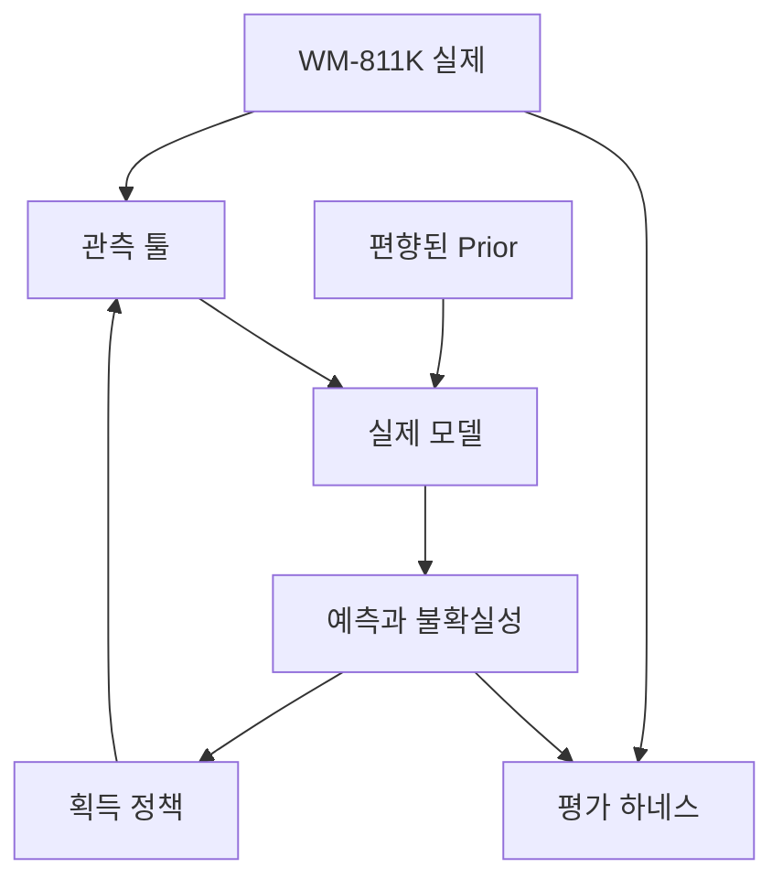

# 시스템 설계

::: tip 아래 표의 모든 행은 실제로 존재하는 파일을 가리킨다
Python 패키지는 `nano/`에 있다. 이 페이지는 코드보다 먼저 작성되었고, 이후 코드에 맞춰
수정되었다. 각 모듈 링크는 실제 파일로 연결되며, 여기서 설명하는 경계는 `tests/`가 강제하는
경계다 — 측정되지 않은 모든 다이에서 숨겨진 실제를 뒤집은 뒤 에이전트의 궤적이 동일하게 나오는지
검증하는 누수 테스트도 포함된다.
:::

## 데이터 흐름

실제는 오직 관측 툴을 통해서만 에이전트에 도달한다. 편향된 prior와 관측된 값이 실제 모델에 입력되고, 실제 모델은 예측과 불확실성을 내보낸다. 획득 정책은 그것들을 읽고 관측 툴에 다이 하나를 더 요청한다. 실제는 평가 하네스로도 직접 흐르며, 에이전트는 평가 하네스를 절대 읽지 않는다.

이 그래프에서 가장 중요한 성질 하나: **실제는 오직 관측 툴을 통해서만 에이전트에 도달한다**.
실제에서 평가 하네스로 가는 직접 간선은 에이전트가 결코 보지 못하는 ground truth를 나른다.
그 경계를 가로지르는 어떤 지름길도 [벤치마크 페이지](./benchmark)의 모든 숫자를 무효로 만든다.

## 모듈

| 모듈 | 책임 | 입력 | 출력 |
| --- | --- | --- | --- |
| [`nano/data.py`](https://github.com/geniuskey/reality-aware/blob/main/nano/data.py) | WM-811K를 로드하고, 평가 서브셋을 필터링·인덱싱하며, 웨이퍼 내부 다이 마스크를 노출 | 데이터셋 경로, 시드 | 웨이퍼 레코드: 실제 필드, 다이 마스크, 패턴 레이블 |
| [`nano/prior.py`](https://github.com/geniuskey/reality-aware/blob/main/nano/prior.py) | 실제 필드로부터 의도적으로 편향된 시뮬레이션 prior를 생성 | 실제 필드, 편향 파라미터 | 웨이퍼 내부 모든 다이에 정의된 prior 필드 |
| [`nano/tools/observe.py`](https://github.com/geniuskey/reality-aware/blob/main/nano/tools/observe.py) | 실제로 통하는 유일한 채널. 다이 하나의 값을 드러내고 예산 한 단위를 소모 | 다이 인덱스 | 측정값, 갱신된 관측 상태 |
| [`nano/model.py`](https://github.com/geniuskey/reality-aware/blob/main/nano/model.py) | prior와 관측을 조화시키고 예측, 불확실성, reality-gap, 예상 불일치 맵을 생성 | prior, 관측 마스크, 관측값 | `prediction`, `uncertainty`, `reality_gap`, `expected_disagreement` |
| [`nano/policy.py`](https://github.com/geniuskey/reality-aware/blob/main/nano/policy.py) | 측정되지 않은 다이에 점수를 매기고 다음 측정을 선택 | 모델 출력, 관측 마스크 | `next_index`, `next_score`, 항별 분해 |
| [`nano/agent.py`](https://github.com/geniuskey/reality-aware/blob/main/nano/agent.py) | 예산이 소진될 때까지 관측 → 추정 → 선택 → 측정 루프를 실행 | 웨이퍼 레코드, 예산, 시드 | 결정 추적, 단계별 맵 |
| [`nano/baselines.py`](https://github.com/geniuskey/reality-aware/blob/main/nano/baselines.py) | 동일한 정책 인터페이스 뒤에 있는 Random과 Grid 선택 규칙 | 모델 출력, 관측 마스크 | `next_index` |
| [`nano/evaluate.py`](https://github.com/geniuskey/reality-aware/blob/main/nano/evaluate.py) | 숨겨진 ground truth에 대해 예측을 채점하고 웨이퍼와 시드에 대해 집계 | 예측, 실제 필드 | `results/benchmark_summary.json` |
| [`nano/figures.py`](https://github.com/geniuskey/reality-aware/blob/main/nano/figures.py) | 게시되는 모든 그림을 예시가 아니라 실제 실행에서 그림 | 요약 파일 또는 에피소드 | `results/*.svg`, `results/*.webp`, `results/demo.gif` |
| [`nano/cli.py`](https://github.com/geniuskey/reality-aware/blob/main/nano/cli.py) | 공통 인자 파싱, 그리고 벤치마크가 실행한 것과 똑같이 에피소드 하나를 재실행 | 명령줄 인자 | 웨이퍼 레코드, 에피소드 번들 |

진입점: `python -m nano.benchmark`(모든 조건 실행, 결과 파일 작성), `python -m nano.demo`(설명이
붙은 에피소드 하나와 그 그림들), `python -m nano.subset`(로컬 WM-811K에서 버전 관리되는 평가
인덱스를 생성).

## 중요한 경계들

**하나의 툴, 하나의 예산.** 모든 측정은 `nano.tools.observe`를 거친다. 예산 회계는 호출자가
아니라 툴 내부에 있으므로, 어떤 전략도 몰래 한 번 더 들여다볼 수 없다.

**베이스라인은 정책 인터페이스를 공유한다.** Random과 Grid는 NANO 정책과 동일한 시그니처를
구현하며 동일한 루프로 구동된다. 각 조건 사이에서 바뀌는 것은 선택 규칙뿐이며 —
이것이 비교를 의미 있게 만드는 요소다.

**평가는 모든 것의 하류에 있다.** `nano.evaluate`는 전체 실제 필드를 만지는 유일한 모듈이며,
에이전트에게 아무것도 돌려주지 않는다.

**결과 파일은 하나.** `nano.evaluate`가 `results/benchmark_summary.json`을 쓰고, 사이트가 그것을
읽는다. 이 사이트의 차트, 표, 대표 숫자는 모두 그 파일에서 파생되므로, 한 곳에서만 숫자가
갱신되고 다른 곳은 낡은 채로 남는 일이 생길 수 없다. 스키마는
[벤치마크 페이지](./benchmark)에 문서화되어 있다.

## 문서 사이트

이 사이트는 의도적으로 단조롭다. 백엔드도, 런타임 데이터 페칭도, 애널리틱스도 없는 정적
VitePress 빌드다.

| 구성 요소 | 경로 | 역할 |
| --- | --- | --- |
| 설정 | `docs/.vitepress/config.mts` | 내비게이션, 사이드바, SEO, Mermaid, 프로젝트 및 사용자 Pages를 위한 base-path 처리 |
| 결과 로더 | `docs/.vitepress/data/benchmark.data.mts` | 빌드 시점에 `results/benchmark_summary.json`을 읽고 검증 |
| 에셋 로더 | `docs/.vitepress/data/assets.data.mts` | `docs/public/results/`를 나열하여 누락된 그림이 대기 상태로 격하되도록 처리 |
| 컴포넌트 | `docs/.vitepress/theme/components/` | `AgentLoop`, `WaferComparison`, `BenchmarkChart`, `BenchmarkTable`, `EvidenceStrip`, `MetricCard`, `ResultAsset` |
| 에셋 동기화 | `scripts/sync-doc-assets.mjs` | 게시된 그림을 `results/`에서 `docs/public/results/`로 복사 |
| 플레이그라운드 소스 | `playground/template.html` | 웨이퍼를 뺀 페이지 자체 — 마크업, 스타일, 그리고 루프의 JavaScript 이식본 |
| 플레이그라운드 빌드 | `nano/playground.py` | 평가 웨이퍼와 게시된 설정을 심어 `docs/public/playground.html`을 작성 |
| 플레이그라운드 대조 | `scripts/check-playground-parity.mjs` | Python의 결정을 그 페이지가 실제로 싣고 있는 엔진으로 재생하고 결과를 페이지에 새김 |
| 배포 | `.github/workflows/deploy-docs.yml` | `main`에 푸시될 때 빌드하고 GitHub Pages에 게시 |

컴포넌트는 빌드 시점에 렌더링되므로, 페이지는 내용을 정적 HTML로 담고 있다. JavaScript를
비활성화해도 본문, 표, 웨이퍼 도식, 결과 그림은 모두 그대로 읽힌다. 클라이언트 런타임이 필요한
것은 Mermaid 다이어그램과 검색창뿐이다.

예외는 <PlaygroundLink>플레이그라운드</PlaygroundLink> 하나다. 브라우저에서 루프를 다시 돌리므로
JavaScript 없이는 아무것도 아니다. 그래도 서비스가 아니라 파일이다. 평가 웨이퍼 12장과 그
prior가 페이지 안에 들어 있어서 실행 중에 아무것도 가져오지 않는다.

다음: [직접 실행해 보기 →](./reproducibility)
