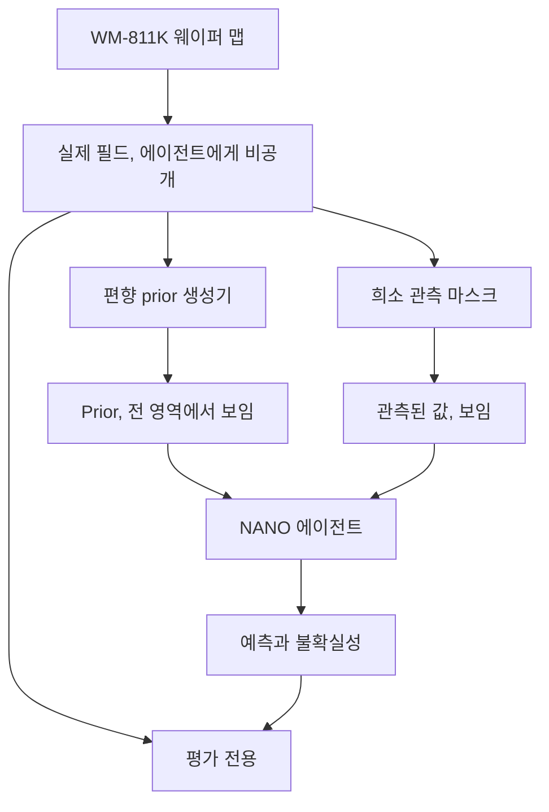

# 데이터셋과 실험 설계

## 출처

MVP는 **WM-811K wafer map dataset** — 반도체 제조 현장에서 수집된 811,457장의 실제 웨이퍼 맵 — 을
사용한다. 이 데이터셋은 Wu, Jang and Chen, *"Wafer Map Failure Pattern Recognition and Similarity
Ranking for Large-Scale Data Sets"*, IEEE Transactions on Semiconductor Manufacturing, 2015 와 함께
공개되었다.

| | |
| --- | --- |
| 공식 배포처 | [MIR Lab public datasets](http://mirlab.org/dataSet/public/) (`LSWMD.pkl`) |
| 널리 쓰이는 미러 | [Kaggle: WM-811K wafer map](https://www.kaggle.com/datasets/qingyi/wm811k-wafer-map) |
| 이용 약관 | 이 프로젝트가 아니라 배포처가 정한다. 재배포하기 전에 내려받은 페이지의 라이선스를 반드시 확인하세요. |
| 이 저장소에 포함된 것 | **WM-811K 원본 데이터는 이 저장소에 커밋되어 있지 않다.** 데이터셋은 로컬에서 내려받으며, 버전 관리 대상은 파생된 서브셋 인덱스뿐이다. |

::: tip 구현 상태
서브셋 빌더는 `python -m nano.subset`, 하네스는 `python -m nano.benchmark`다. 아래에서
`recorded at run time`이라고 적힌 항목은 이 페이지에서 의도적으로 비워 둔 것이다. 손으로 입력하는
값이 아니라 실행이 만들어 내는 산출물에서 채워지며, 이 저장소는 아직 WM-811K에 대한 실행 결과를
게시하지 않았다.

데이터셋 사본이 없어도 파이프라인은 생성된 대체 웨이퍼(`--synthetic`)로 실행된다. 그것은
WM-811K가 **아니다**. 결과 파일은 `dataset.name`을 `synthetic-wafers`로 기록하고 주석을 남기며,
모든 명령은 경고를 출력하고, 이 사이트의 결과 표는 웨이퍼 출처를 함께 표시한다.
[정직한 범위](./limitations)를 참고하세요.
:::

## 웨이퍼 맵의 의미

각 웨이퍼 맵은 다이 그리드 위의 2차원 정수 배열이다.

| 값 | 의미 | 사용 방식 |
| --- | --- | --- |
| `0` | 웨이퍼 바깥 / 이 그리드 위치에 다이 없음 | 마스크 처리, 예측하지 않고 측정하지도 않음 |
| `1` | 다이 있음, 양품 | 실제 값 `0.0` |
| `2` | 다이 있음, 불량 | 실제 값 `1.0` |

따라서 NANO가 재구성하는 양은 **웨이퍼 내부 다이 그리드 위의 다이별 이진 불량 지표**다.
재구성 오차는 웨이퍼 내부 위치에 대해서만 측정한다.

## 전처리 규칙

1. 다이 그리드가 최소 사용 가능 크기보다 작은 웨이퍼는 제외한다. 다이가 몇 개뿐인 웨이퍼에서는
   희소한 예산이라는 개념 자체가 의미가 없기 때문이다(`--min-dies`, 기본값 400).
2. 불량 패턴 레이블이 달린 웨이퍼만 남긴다. 그래야 결과를 패턴 종류별로 나누어 볼 수 있다.
   이어서 평가 집합은 남은 패턴 클래스들을 라운드 로빈으로 돌며 뽑으므로, 한 클래스가 전체를
   차지하지 않는다.
3. 웨이퍼 내부 마스크는 `value != 0` 으로 만들고 이를 알려진 형상으로 취급한다 — 에이전트는 어떤
   그리드 위치에 다이가 있는지 알아도 된다.
4. `{1 → 0.0, 2 → 1.0}` 으로 매핑하여 실제 필드를 얻는다.
5. 웨이퍼의 크기를 바꾸거나 보간하지 않는다. 공간 구조 자체가 연구 대상 신호다.

## 핵심 실험 아이디어

> 우리는 완전한 WM-811K 웨이퍼 맵을 숨겨진 실제로 취급하고, 에이전트에게는 희소한 관측만 노출한다.
> 의도적으로 편향된 prior(사전 정보)가 시뮬레이션 불일치를 모사하며, 이를 통해 Sim2Real 보정
> 과정을 알려진 ground truth 기준으로 평가할 수 있다.

이것이 이 실험을 채점 가능하게 만드는 지점이다. 실제 계측에는 비교 대상이 될 웨이퍼 전체가 결코
존재하지 않는다. 여기서는 존재하며, 비교가 공정하게 유지되도록 에이전트에게는 감춘다.



<p class="nano-note">WM-811K 웨이퍼 맵이 숨겨진 실제 필드가 된다. 여기서 편향 prior 생성기가 에이전트가 전 영역에서 보게 될 prior를 만들고, 관측 마스크가 에이전트가 읽을 수 있는 소수의 값을 만든다. 둘 다 에이전트로 들어가고, 에이전트는 예측과 불확실성을 출력한다. 실제와 예측은 오직 평가 하네스 안에서만 만난다.</p>

### 평가 인덱스 만들기

```bash
python -m nano.subset --raw data/raw/LSWMD.pkl --wafers 12 --seed 0
```

이 명령은 `data/subsets/wm811k_eval.json`을 쓴다. 웨이퍼 인덱스, 패턴 레이블, 그리드 형상, 다이
개수, 그리고 그것들을 선택한 필터와 시드가 담긴다. 인덱스는 버전 관리되지만, 그것을 만들어 낸
데이터셋은 그렇지 않다. `python -m nano.benchmark`는 이 인덱스와 로컬 `LSWMD.pkl`로 동일한 평가
집합을 복원한다.

### 편향된 prior 만들기

Prior는 *구조적으로 틀려* 있어야 한다. 시뮬레이션이 틀리는 방식이 바로 그렇기 때문이다. ground truth에
무작위 잡음을 더하는 것은 훨씬 쉬운 문제이며 흥미로운 것을 아무것도 검증하지 못한다. Prior는 실제
필드로부터 다음을 합성하여 생성한다.

- **공간 평활화** — 마스크를 인식하는 가우시안 블러(`smoothing_sigma`). 실제에 존재하는 미세
  구조가 prior에는 없게 된다. 웨이퍼 바깥 위치는 0으로 취급하는 대신 블러에서 제외한다. 그렇지
  않으면 엉뚱한 이유로 edge 값이 끌려 내려간다.
- **반경 방향 편향** — 불량을 `1 − radial_strength × radius^radial_power`로 축소하여, 웨이퍼
  edge 쪽으로 갈수록 체계적으로 과소 예측한다. 중심부 측정으로 캘리브레이션된 모델의 전형적인
  특징이다.
- **전역 오프셋과 이득** — 웨이퍼 전체에 적용된 캘리브레이션 오차.

편향 파라미터는 `nano/prior.py`의 `BiasParams`에 있고, 결정론적이며, 결과 파일의
`experiment.prior_bias`에 기록되고, 모든 전략 arm에서 동일하다.

### 초기 관측 마스크 뽑기

초기 마스크는 균일하게가 아니라 **중심 편향으로** 뽑는다. [문제 페이지](./problem)에서 설명한
샘플링 편향을 재현하기 위해서다. Random, Grid, NANO를 포함한 모든 전략은 주어진 `(wafer, seed)`
쌍에 대해 *동일한* 초기 마스크에서 출발한다. 차이가 나는 것은 추가 측정뿐이다.

## 평가 프로토콜

| 설정 | 값 |
| --- | --- |
| 평가 웨이퍼 | 필터링된 서브셋에서 시드로 샘플링, 불량 패턴별 층화 추출 · `실행 시 기록` |
| 시드 | `실행 시 기록` |
| 초기 측정 수 | `실행 시 기록` |
| 추가 측정 예산 | `실행 시 기록` |
| 지표 | 웨이퍼 내부 다이에 대한 재구성 오차, 방향은 결과 파일에 기록 |
| Ground truth 접근 | 평가 하네스만 접근 <span class="nano-tag" data-kind="hidden">에이전트에게 비공개</span> |

통상적인 의미의 train/test 분할은 없다. 웨이퍼 전체에 걸쳐 학습되는 것은 아무것도 없다. 각 웨이퍼는
독립적인 능동 측정 에피소드이며, 보고되는 지표는 `wafers × seeds` 에 대한 분포다. 이는 의도적인
선택이다. 교차 웨이퍼 모델이 가져올 수 있는 이득으로부터 선택 규칙을 분리하기 때문이다.

## 프록시에 대한 정직한 설명

이 구성은 **Sim2Real 자체가 아니라 Sim2Real의 프록시**다.

- Prior는 ground truth를 인위적으로 왜곡한 것이지, TCAD, CAE, RCWA 시뮬레이터의 출력이 아니다.
  그 안에 물리는 들어 있지 않다.
- WM-811K 레이블은 이진 양품/불량이지, CD, thickness, overlay 같은 연속적인 계측값이 아니다. 실제
  계측값은 연속적이고 잡음이 있으며, 추정기는 다른 문제를 마주하게 된다.
- 모든 다이의 측정 비용이 동일하다고 가정하는데, 이는 실제 장비 스케줄링에서는 사실이 아니다.

이 프록시가 *실제로* 뒷받침하는 것은 이 프로젝트가 던지고 있는 질문이다. 고정된 예산과 편향된 prior가
주어졌을 때, 획득 점수로 측정을 고르는 것이 관례로 고르는 것보다 나은가? 자세한 내용은
[정직한 범위](./limitations)에 있다.

다음: [결과 →](./benchmark)
