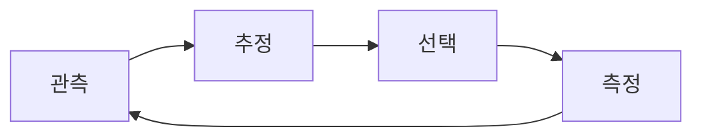

## 반도체 AI는 측정한 것에서 배운다 — 실제에서 배우는 것이 아니다

모델은 보유한 데이터에서 좋은 점수를 내면서도 웨이퍼에 대해서는 틀릴 수 있다. 수백만 개 다이를 전수
검사하는 것은 불가능하므로 모든 데이터셋은 표본이고, 모든 표본은 지표에 드러나지 않는 편향을 안고 있다.
높은 정확도는 실제에 대한 신뢰도와 같은 것이 아니다.

  

    
제약 01

    <h3>희소한 검사</h3>
    
측정할 수 있는 다이는 극히 일부다. 나머지는 그렇게 부르든 부르지 않든 추론이다.

  

  

    
제약 02

    <h3>Sim2Real 불일치</h3>
    
시뮬레이션은 웨이퍼 전체를 덮지만 체계적으로 어긋나 있다. 측정은 정확하지만 거의 아무 곳도 덮지 못한다.

  

  

    
제약 03

    <h3>국소적 측정 편향</h3>
    
SEM과 TEM은 매우 좁은 시야(FOV)만 보고, 샘플링 계획은 편한 위치를 반복해서 다시 찾는 경향이 있다.

  

  

    
제약 04

    <h3>결측된 공정 데이터</h3>
    
공정과 계측 테이블은 빈칸을 포함한 채 도착하므로, 피처 공간 자체가 부분적으로만 관측된다.

  

NANO는 AI 개발 라이프사이클(AI DLC)을 다시 정의한다. 마침 존재하는 데이터로 학습하는 대신, 정해진 측정
예산 안에서 실제를 이해하는 데 필요한 데이터를 능동적으로 획득한다.

**측정 한 번당 얻는 실제에 대한 지식을 최대화한다.**

## 에이전트가 보는 것

<WaferComparison />

## 루프

관측 &rarr; 추정 &rarr; 선택 &rarr; 측정 &rarr; 다시 관측으로. 측정 예산 한 단위마다 한 번씩 돈다.

<AgentLoop />

이 에이전트는 예측만 하지 않는다. 불확실성을 정량화하고 다음에 무엇을 측정해야 하는지 결정한다.
보간이 아니라 그 결정이 이 프로젝트의 기여다.

## 근거

<EvidenceStrip />

## 직접 실험을 실행해 보기

이 사이트의 모든 숫자는 저장소 안의 단 하나의 결과 파일 — WM-811K 웨이퍼 12장 × 시드 5개 실행 —
에서 생성된다. 페이지에 손으로 써넣은 값은 없으며, 아티팩트가 없는 페이지는 값을 지어내는 대신 없다고
말한다.

  
저장소를 클론하고 벤치마크를 실행하면 이 사이트의 모든 그림이 다시 생성된다.

  <a class="nano-cta" href="./reproducibility">직접 실험을 실행해 보기</a>

