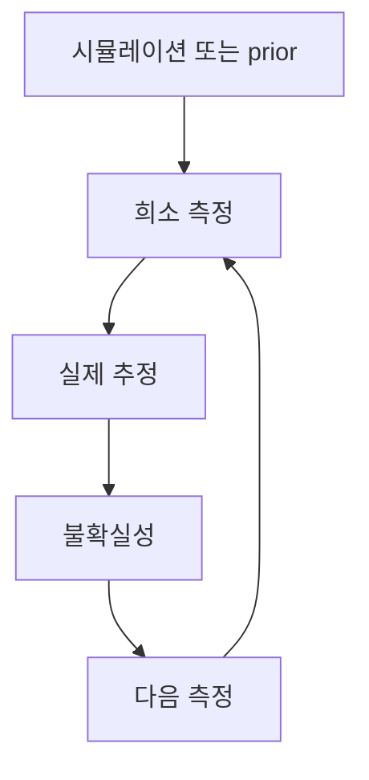

# 왜 실제 인식이 필요한가?

> **가용 데이터 ≠ 표현된 실제**

제조 데이터로 학습한 모델은 측정된 공정의 일부만 학습한다. 나머지는 전부 가정이다. 그 가정은 대개
보이지 않는다. 평가셋이 학습셋과 같은 편향된 샘플에서 뽑히기 때문이다 — 그래서 지표는 둘 다 본 적
없는 실제에 대해 모델과 의견이 일치한다.

## 샘플이 웨이퍼를 대변하지 못하는 다섯 가지 방식

### 1. 전수 검사는 불가능하다

웨이퍼 한 장에는 수천 개의 다이가 있고, 팹은 하루에 수백만 개를 생산한다. 이를 전부 측정하는 것은
경제적으로도 물리적으로도 불가능하다. 반도체 계측에서 샘플링은 지름길이 아니라 유일한 선택지다.
남는 질문은 *어떤* 샘플을 고를 것인가이다.

### 2. 샘플링은 공간적으로 편향되어 있다

샘플링 계획은 장비 처리량, 고정된 레시피, 관행에 따라 정해진다. 편한 위치는 반복해서 측정되고,
까다로운 위치 — 웨이퍼 edge, 특정 반경 구간, 특정 레티클 위치 — 는 드물게 측정된다. 그렇게 만들어진
데이터셋은 공정 거동이 벗어나기 쉬운 바로 그 영역을 체계적으로 과소 대표한다.

### 3. SEM과 TEM은 거의 아무것도 보지 못한다

고해상도 이미징은 얻을 수 있는 가장 신뢰받는 증거이면서 동시에 가장 좁은 증거다. 시야(FOV) 하나는
다이의 극히 일부만 담고, 다이 하나는 웨이퍼의 극히 일부만 차지한다. 이미지 한 장은 매우 국소적인
질문에 높은 확신으로 답하지만, 웨이퍼에 대해서는 통계적으로 아무것도 말해주지 않는다.

### 4. 누락되는 것은 행만이 아니라 피처다

공정, 설비, 계측 테이블은 여러 시스템에 걸쳐 조인되며, 그 조인은 불완전하다. 결측이 균일한 경우는
거의 없다. 결측은 장비, 레시피, 시간 구간, 재작업 경로와 상관관계를 갖는다. 이를 노이즈로 보고
대치하면 구조적인 공백이 확신에 찬 오답으로 바뀐다.

### 5. 시뮬레이션과 실제는 어긋난다

시뮬레이션은 조밀한 커버리지를 준다 — 모든 다이에 대한 값 — 그러나 모델 오차, 캘리브레이션 드리프트,
모델링되지 않은 물리를 함께 안고 있다. 측정은 희소한 ground truth를 준다. 어느 쪽도 혼자서는 웨이퍼를
설명하지 못한다. 둘 사이의 간극이 Sim2Real 격차이며, 이를 좁히는 일은 모델링 문제이기 이전에 측정
문제다.

## 문제를 감추는 라이프사이클

통상적인 AI 개발 라이프사이클(AI DLC)은 데이터 수집을 상류에서 이미 정해진 사실로 취급한다:

가용 데이터 수집 &rarr; 학습 &rarr; 평가 &rarr; 배포 &rarr; 모니터링, 모니터링은 학습으로만 되돌아간다. 수집 단계는 결코 다시 검토되지 않는다.

수집 이후의 모든 단계는 모델이 샘플에 얼마나 잘 맞는지를 개선할 수 있을 뿐이다. 샘플이 웨이퍼를
잘못 대변하고 있다면, 어느 단계도 그 사실을 말해주지 않는다. 평가셋은 같은 편향을 그대로 물려받고,
그래서 정확도는 올라가는 동안 실제와의 간극은 그대로 열려 있다.

## NANO가 제안하는 라이프사이클

수집을 루프의 일부로 만들고, 불확실성이 그 루프를 이끌게 한다:

시뮬레이션 또는 prior(사전 정보) &rarr; 희소 측정 &rarr; 실제 추정 &rarr; 불확실성 &rarr; 다음 측정, 그리고 다시 희소 측정으로 돌아온다. 다음에 무엇을 수집할지를 이끄는 것은 학습 스케줄이 아니라 불확실성이다.

차이는 결정이 어디에 있느냐다. 통상적인 라이프사이클에서 모델은 무엇을 예측할지를 결정한다. 여기서
에이전트는 무엇을 *학습할지*까지 결정한다 — 다음 측정을 어느 다이에 쓸 가치가 있는지를.

## 정확도는 실제 신뢰도가 아니다

혼동하기 쉽지만, 이 사이트의 나머지 부분을 위해 구분해 둘 가치가 있는 두 가지 양이 있다:

| 양 | 답하는 질문 | 필요한 것 |
| --- | --- | --- |
| **정확도** | 내가 수집한 데이터에 모델이 얼마나 잘 맞는가? | 같은 샘플에서 떼어낸 홀드아웃 분할 |
| **실제 신뢰도** | 웨이퍼 중 내가 실제로 아는 부분은 얼마이며, 어디가 사각지대인가? | 측정되지 않은 위치에 대한 캘리브레이션된 불확실성 맵 |

모델은 높은 정확도와 낮은 실제 신뢰도를 동시에 가질 수 있다. NANO는 두 번째 것을 보고하고 줄이기
위해 만들어졌다.

## NANO는 이에 대해 무엇을 하는가

측정 예산이 주어지면, NANO는 편향된 prior와 희소한 관측으로부터 웨이퍼 전체를 추정하고, 그 추정이
약한 지점을 정량화하며, 다음에 측정할 다이를 선택한다.

다음: [에이전트가 관측하고 결정하는 방법 →](./approach)
