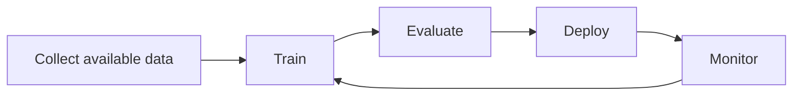
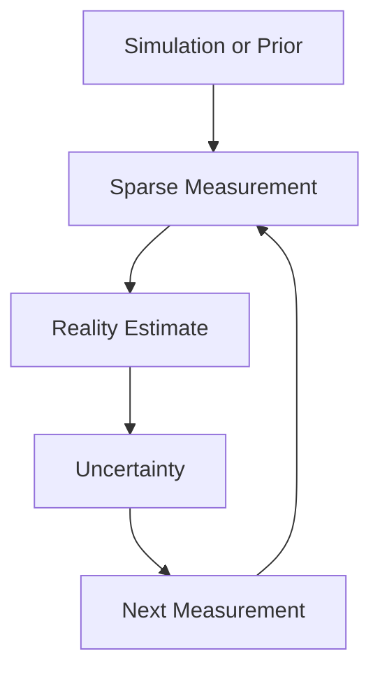

# Why Reality Awareness?

> **available data ≠ represented reality**

A model trained on manufacturing data learns the part of the process that was measured. Everything
else is an assumption. That assumption is usually invisible, because the evaluation set is drawn
from the same biased sample as the training set — so the metric agrees with the model about a
reality neither of them has seen.

## Five ways the sample fails the wafer

### 1. Full inspection is impossible

A wafer carries thousands of dies and a fab produces millions per day. Measuring all of them is
neither economically nor physically feasible. Sampling is not a shortcut in semiconductor metrology;
it is the only option. The open question is *which* samples.

### 2. Sampling is spatially biased

Sampling plans are shaped by tool throughput, fixed recipes and habit. Convenient sites are measured
repeatedly, awkward ones — wafer edge, specific radial zones, particular reticle positions — are
measured rarely. The resulting dataset systematically under-represents exactly the regions where
process behaviour tends to deviate.

### 3. SEM and TEM see almost nothing

High-resolution imaging is the most trusted evidence available and also the narrowest. A field of
view covers a minute fraction of a die, and a die covers a minute fraction of a wafer. One image
answers a very local question with high confidence, and says nothing statistically about the wafer.

### 4. Features are missing, not just rows

Process, equipment and metrology tables are joined across systems, and the join is incomplete.
Missingness is rarely uniform: it correlates with tool, recipe, time window and rework path. Imputing
it as noise turns a structured gap into a confident wrong answer.

### 5. Simulation and reality disagree

Simulation gives dense coverage — a value for every die — but carries model error, calibration drift
and unmodelled physics. Measurement gives sparse ground truth. Neither alone describes the wafer.
The gap between them is the Sim2Real gap, and closing it is a measurement problem before it is a
modelling problem.

## The lifecycle that hides the problem

The conventional AI Development Lifecycle (AI DLC) treats data acquisition as a fixed upstream fact:

Collect available data &rarr; Train &rarr; Evaluate &rarr; Deploy &rarr; Monitor, with monitoring feeding back only into training. Acquisition is never revisited.

Every stage after collection can only improve how well the model fits the sample. If the sample
misrepresents the wafer, none of them will say so. The evaluation set inherits the same bias, so
accuracy rises while the gap to reality stays open.

## The lifecycle NANO proposes

Make acquisition part of the loop and make uncertainty the thing that drives it:

Simulation or prior &rarr; Sparse measurement &rarr; Reality estimate &rarr; Uncertainty &rarr; Next measurement, which loops back to sparse measurement. Uncertainty, not a training schedule, drives what gets collected next.

The difference is where the decision lives. In the conventional lifecycle, the model decides what to
predict. Here the agent also decides what to *learn* — which die is worth spending the next
measurement on.

## Accuracy is not reality confidence

Two quantities are easy to conflate and worth separating for the rest of this site:

| Quantity | Question it answers | What it needs |
| --- | --- | --- |
| **Accuracy** | How well does the model fit the data I collected? | A held-out split of the same sample |
| **Reality confidence** | How much of the wafer do I actually know, and where am I blind? | A calibrated uncertainty map over unmeasured locations |

A model can have high accuracy and low reality confidence at the same time. NANO is built to report
and reduce the second one.

## What NANO does about it

Given a measurement budget, NANO estimates the full wafer from a biased prior plus sparse
observations, quantifies where that estimate is weak, and selects the next die to measure.

Next: [how the agent observes and decides →](./approach)
